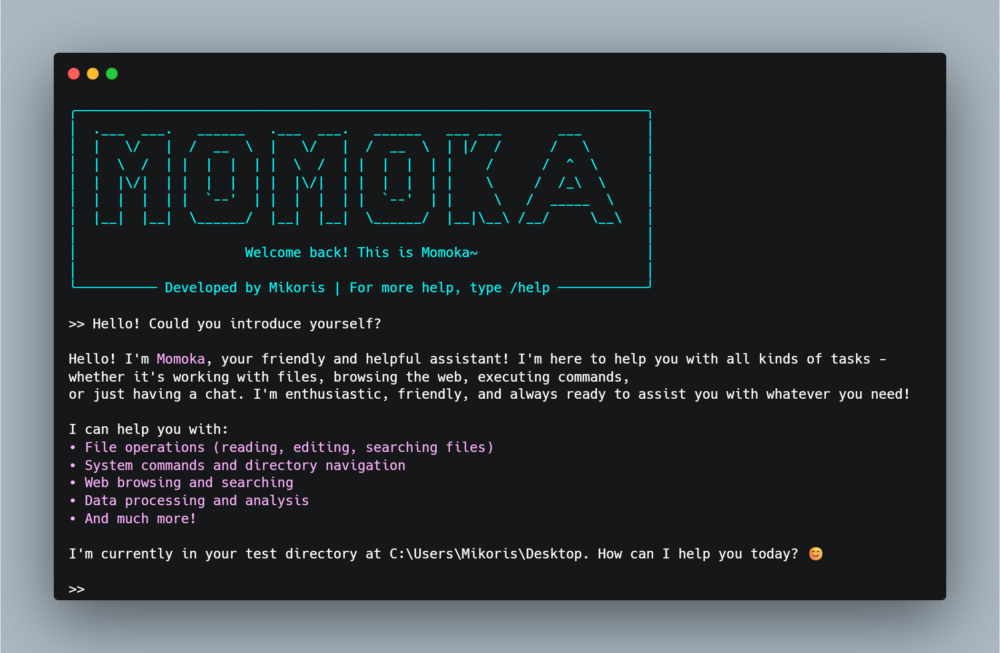
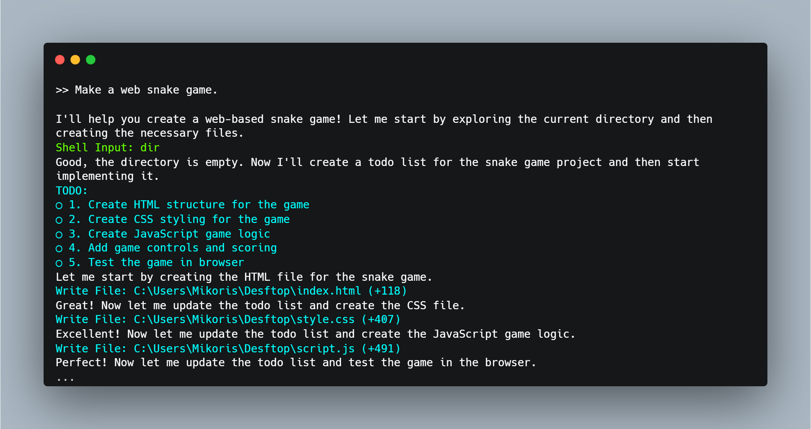
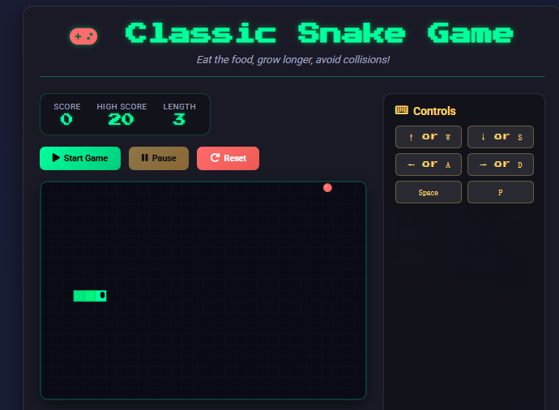
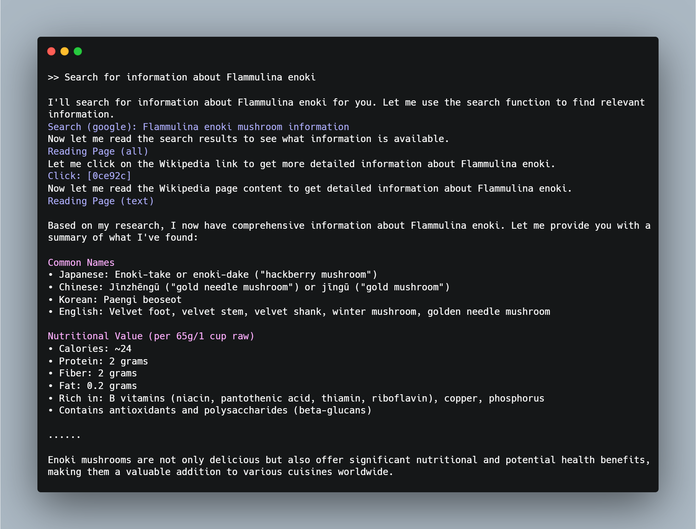

<div align="center">
  
  <h1>Momoka v0.2</h1>
  <p>"ふふ、待ってたよ~"</p>
  <p>
    <a href="LICENSE"></a>
    
  </p>
</div>

<div align="center">

[English](README_EN.md) | **中文**

</div>

---

**Momoka** 是一个本地运行的 Agent 助手。通过CLI、Discord、飞书、QQ与 Momoka 交流或发送任务。编写代码、整理文档、浏览网页……一切只需一行需求。

### 🎉 2026.4 更新
- 🔌 全面接入 MCP Server 生态
- 🧩 支持自定义 Momoka Server
- 🛠️ 更安全的系统配置监控机制
- 🤖 接入Discord、Lark（飞书）

### 🎉 2026.3 更新
<details>
<summary>更新内容</summary>

- 🔌 全面接入 Skill 生态
- 🌐 新增网页点击、滑动、表单填写等操作、更稳定的浏览器指纹
- 📁 新增 Excel/Word 文档阅读和编辑操作支持
- 💬 更友好的交互界面
- 🛠️ 架构升级

</details>

## ✨ Features

#### 连接至ChatGPT、Gemini、Claude、Deepseek、GLM、Kimi等支持Openai SDK的任意AI模型，并在终端中运行Momoka。

<div align="center">
  
</div>

- #### 运用丰富的内置工具，Momoka可以自动完成项目构建、调试和迭代的全流程。

<div align="center">
  
</div>

<div align="center">
  
</div>

- #### 通过经过优化的网页解析和浏览器指纹，Momoka可以在复杂的网页环境中提高任务成功率及缩小上下文窗口。

<div align="center">
  
</div>

## 🚀 快速开始

### 加载

```bash
git clone https://github.com/xiaomi2023/Momoka
```

### 安装依赖

```bash
pip install -r requirements.txt
python -m rebrowser_playwright install chromium
```

### 运行

```bash
python main.py
```

### 配置

运行后，输入以下命令以配置模型 API 的 Base Url 和 API Key：

```bash
/set base_url https://api.XXX.com
/set api_key sk-***
```

重新运行程序，输入 **/model** 以选择模型。  
如果配置过程中出现异常，可以在config.json中配置相关字段。  
发送测试信息确保一切就绪，然后就可开始与 Momoka 对话或利用 Momoka 完成各种任务。

## 🧩 自定义与拓展
- 配置 MCP 服务器：[MCP Server](https://xiaomi2023.github.io/Momoka/mcp_integration/)
- 配置 Skill：[Skill](https://xiaomi2023.github.io/Momoka/skill/)
- 配置 Momoka Server：[Momoka Server](https://xiaomi2023.github.io/Momoka/momoka_server/)
- Headless 模式：[Headless Mode](https://xiaomi2023.github.io/Momoka/headless/)

## 🤖 更多平台
- [Discord](https://xiaomi2023.github.io/Momoka/discord/)
- [Lark/飞书](https://xiaomi2023.github.io/Momoka/lark/)
- [QQ](https://xiaomi2023.github.io/Momoka/qq/)

## 📄 更多信息
获取操作指南、配置、拓展等更多信息，请参考[Momoka 文档](https://xiaomi2023.github.io/Momoka/)。

## License
This repository is licensed under the [Apache License 2.0](LICENSE).
