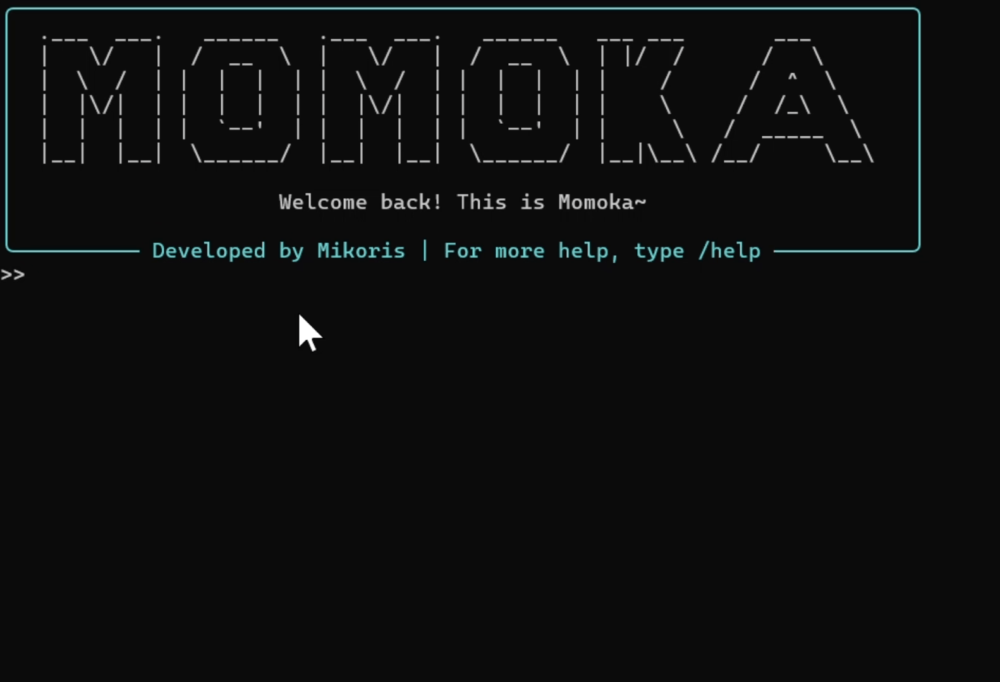
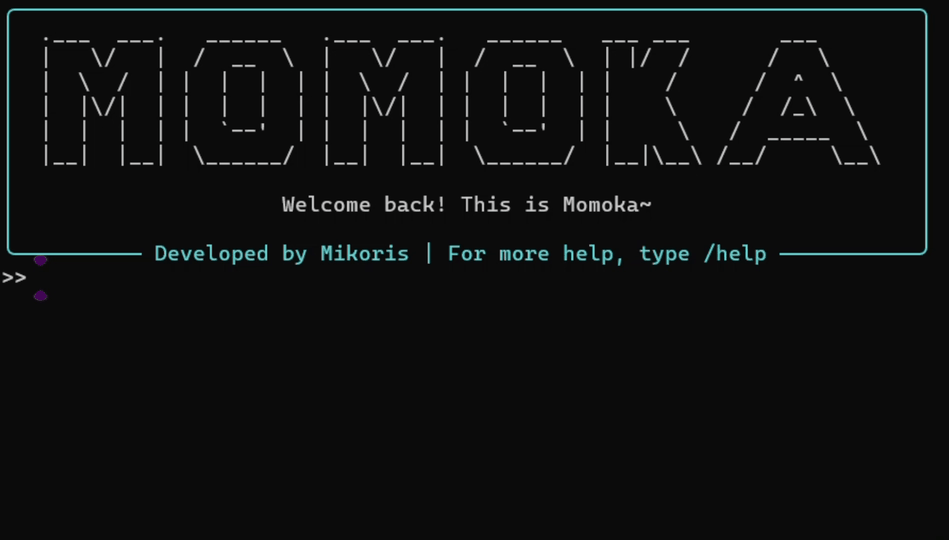

<div align="center">
  
  <h1>Momoka v0.2</h1>
  <p>"ふふ、待ってたよ~"</p>
  <p>
    <a href="LICENSE"></a>
  </p>
</div>

---

<div align="center">

**English** | [中文](README.md)

</div>

---

**Momoka** is a locally running AI Agent assistant. Write code, organize documents, browse the web... everything with just a single line of request.

## 🎉 March 2026 Update
- 🔌 Fully integrated with Skill ecosystem
- 🌐 Added web page clicking, scrolling, form filling and other operations; more stable browser fingerprint
- 📁 Added support for Excel/Word document reading and editing
- 💬 More user-friendly interactive interface
- 🛠️ Architecture upgrade

## ✨ Features

#### Connect to any AI model supporting OpenAI SDK such as ChatGPT, Gemini, Claude, Deepseek, GLM, Kimi, and run Momoka in the terminal.

<div align="center">
  
</div>

- #### With rich built-in tools, Momoka can automatically complete the full process of project building, debugging and iteration.

<div align="center">
  
</div>

- #### Through optimized web page parsing and browser fingerprint, Momoka improves task success rate and reduces token consumption in complex web environments.

## 🚀 Quick Start

### Clone

```bash
git clone https://github.com/xiaomi2023/Momoka
```

### Install Dependencies

```bash
pip install openai rebrowser-playwright openpyxl python-docx rich
python -m rebrowser_playwright install chromium
```

### Run

```bash
python main.py
```

### Configuration

After running, enter the following commands in the console to configure the Base URL and API Key for the model API, as well as Momoka's working directory:
```bash
/set base_url https://api.XXX.com
/set api_key sk-***
/set work_dir "C:\\Users\\..."
```
Enter **/model** to select a model, and send a test message to ensure everything is ready.  
You can use the **/help** command to get help, or the **/set** command to get more parameter information.

## 🔧 Skill
**Skill** is a modular, reusable package of instructions and tools that can extend the model's capabilities or provide additional knowledge.  
Configure Skills by adding Skill folders containing **SKILL.md** and optional resource files to the `skill/` directory. Skills can be dynamically loaded by the Agent, or manually loaded using the **/[Skill name]** command.  
For more information, please refer to [here](https://platform.claude.com/docs/en/agents-and-tools/agent-skills/).

## More Information
- [Guide](docs/index.md)
  - [Configuration](config.md)
  - [Headless Mode (BETA)](headless.md)
  - [Momoka Server (BETA)](momoka_server.md)

## 📄 License
This repository is licensed under the [Apache License 2.0](LICENSE).
